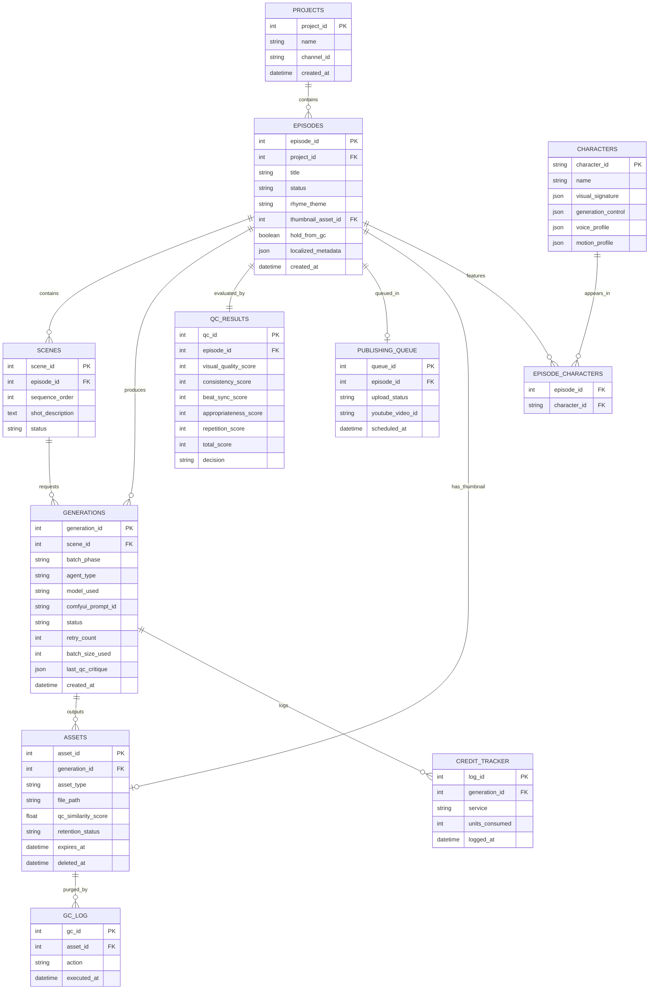

# Spec 02 — Database Schema & Data Models
**Source:** decomposed from Master Blueprint v2.2, §8. Owns: SQLite schema, ER diagram, Pydantic v2 models, retention-field contracts. Operational GC/backup cron behavior lives in **spec_06** — this file owns *schema only*.

---

## 1. ER Diagram



`BACKUP_LOG` (operational tracking for offsite `rclone` sync, defined and used in **spec_06**):

| Field | Type | Notes |
|---|---|---|
| backup_id | int PK | |
| source_path | string | `characters/`, `final/`, or `db/` |
| remote_path | string | `gdrive:...` or `r2:...` |
| status | string | `success` / `failed` |
| bytes_transferred | int | |
| executed_at | datetime | |

---

## 2. SQLite DDL

```sql
CREATE TABLE projects (
    project_id INTEGER PRIMARY KEY AUTOINCREMENT,
    name TEXT NOT NULL,
    channel_id TEXT,
    created_at TEXT NOT NULL DEFAULT (datetime('now'))
);

CREATE TABLE characters (
    character_id TEXT PRIMARY KEY,
    name TEXT NOT NULL,
    visual_signature TEXT NOT NULL,   -- JSON
    generation_control TEXT NOT NULL, -- JSON
    voice_profile TEXT NOT NULL,      -- JSON
    motion_profile TEXT NOT NULL      -- JSON
);

CREATE TABLE episodes (
    episode_id INTEGER PRIMARY KEY AUTOINCREMENT,
    project_id INTEGER NOT NULL REFERENCES projects(project_id),
    title TEXT,
    status TEXT NOT NULL DEFAULT 'draft'
        CHECK (status IN ('draft','in_progress','human_review','publish_ready','published','failed')),
    rhyme_theme TEXT,
    thumbnail_asset_id INTEGER REFERENCES assets(asset_id),
    hold_from_gc INTEGER NOT NULL DEFAULT 0,   -- boolean 0/1
    localized_metadata TEXT,                    -- JSON: {"es": {...}, "hi": {...}}
    created_at TEXT NOT NULL DEFAULT (datetime('now'))
);

CREATE TABLE episode_characters (
    episode_id INTEGER NOT NULL REFERENCES episodes(episode_id),
    character_id TEXT NOT NULL REFERENCES characters(character_id),
    PRIMARY KEY (episode_id, character_id)
);

CREATE TABLE scenes (
    scene_id INTEGER PRIMARY KEY AUTOINCREMENT,
    episode_id INTEGER NOT NULL REFERENCES episodes(episode_id),
    sequence_order INTEGER NOT NULL,
    shot_description TEXT,
    status TEXT NOT NULL DEFAULT 'pending'
        CHECK (status IN ('pending','approved','rejected'))
);

CREATE TABLE generations (
    generation_id INTEGER PRIMARY KEY AUTOINCREMENT,
    scene_id INTEGER REFERENCES scenes(scene_id),
    batch_phase TEXT NOT NULL
        CHECK (batch_phase IN ('A1','A2','B','C','D')),
    agent_type TEXT NOT NULL,
    model_used TEXT NOT NULL,
    comfyui_prompt_id TEXT,
    status TEXT NOT NULL DEFAULT 'queued'
        CHECK (status IN ('queued','running','complete','failed','oom','manual_flag')),
    retry_count INTEGER NOT NULL DEFAULT 0,
    batch_size_used INTEGER,
    last_qc_critique TEXT,   -- JSON, see spec_03
    created_at TEXT NOT NULL DEFAULT (datetime('now'))
);

CREATE TABLE assets (
    asset_id INTEGER PRIMARY KEY AUTOINCREMENT,
    generation_id INTEGER NOT NULL REFERENCES generations(generation_id),
    asset_type TEXT NOT NULL
        CHECK (asset_type IN ('still','thumbnail','clip','audio_song','audio_narration','final_render')),
    file_path TEXT NOT NULL,
    qc_similarity_score REAL,
    retention_status TEXT NOT NULL DEFAULT 'ephemeral'
        CHECK (retention_status IN ('ephemeral','persistent')),
    expires_at TEXT,
    deleted_at TEXT
);

CREATE TABLE qc_results (
    qc_id INTEGER PRIMARY KEY AUTOINCREMENT,
    episode_id INTEGER NOT NULL UNIQUE REFERENCES episodes(episode_id),
    visual_quality_score INTEGER NOT NULL,
    consistency_score INTEGER NOT NULL,
    beat_sync_score INTEGER NOT NULL,
    appropriateness_score INTEGER NOT NULL,
    repetition_score INTEGER NOT NULL,
    total_score INTEGER NOT NULL,
    decision TEXT NOT NULL
        CHECK (decision IN ('publish_ready','human_review','regenerate'))
);

CREATE TABLE credit_tracker (
    log_id INTEGER PRIMARY KEY AUTOINCREMENT,
    generation_id INTEGER REFERENCES generations(generation_id),
    service TEXT NOT NULL,
    units_consumed INTEGER NOT NULL,
    logged_at TEXT NOT NULL DEFAULT (datetime('now'))
);

CREATE TABLE gc_log (
    gc_id INTEGER PRIMARY KEY AUTOINCREMENT,
    asset_id INTEGER NOT NULL REFERENCES assets(asset_id),
    action TEXT NOT NULL CHECK (action IN ('soft_delete','hard_delete','skipped_hold')),
    executed_at TEXT NOT NULL DEFAULT (datetime('now'))
);

CREATE TABLE publishing_queue (
    queue_id INTEGER PRIMARY KEY AUTOINCREMENT,
    episode_id INTEGER NOT NULL REFERENCES episodes(episode_id),
    upload_status TEXT NOT NULL DEFAULT 'pending'
        CHECK (upload_status IN ('pending','uploaded','failed')),
    youtube_video_id TEXT,
    scheduled_at TEXT
);

CREATE TABLE backup_log (
    backup_id INTEGER PRIMARY KEY AUTOINCREMENT,
    source_path TEXT NOT NULL,
    remote_path TEXT NOT NULL,
    status TEXT NOT NULL CHECK (status IN ('success','failed')),
    bytes_transferred INTEGER,
    executed_at TEXT NOT NULL DEFAULT (datetime('now'))
);
```

---

## 3. Pydantic v2 Models (`db/models.py` contract)

All inter-agent and agent↔DB data transfer MUST use these models — no raw dicts crossing module boundaries (enforced in the canonical AI rules file).

```python
from datetime import datetime
from enum import Enum
from typing import Optional
from pydantic import BaseModel, Field, ConfigDict


class EpisodeStatus(str, Enum):
    DRAFT = "draft"
    IN_PROGRESS = "in_progress"
    HUMAN_REVIEW = "human_review"
    PUBLISH_READY = "publish_ready"
    PUBLISHED = "published"
    FAILED = "failed"


class BatchPhase(str, Enum):
    A1 = "A1"
    A2 = "A2"
    B = "B"
    C = "C"
    D = "D"


class GenerationStatus(str, Enum):
    QUEUED = "queued"
    RUNNING = "running"
    COMPLETE = "complete"
    FAILED = "failed"
    OOM = "oom"
    MANUAL_FLAG = "manual_flag"


class AssetType(str, Enum):
    STILL = "still"
    THUMBNAIL = "thumbnail"
    CLIP = "clip"
    AUDIO_SONG = "audio_song"
    AUDIO_NARRATION = "audio_narration"
    FINAL_RENDER = "final_render"


class RetentionStatus(str, Enum):
    EPHEMERAL = "ephemeral"
    PERSISTENT = "persistent"


class QCDecision(str, Enum):
    PUBLISH_READY = "publish_ready"
    HUMAN_REVIEW = "human_review"
    REGENERATE = "regenerate"


class Project(BaseModel):
    model_config = ConfigDict(from_attributes=True)
    project_id: Optional[int] = None
    name: str
    channel_id: Optional[str] = None
    created_at: Optional[datetime] = None


class CharacterVisualSignature(BaseModel):
    species_archetype: str
    color_palette: list[str]
    silhouette_notes: str
    costume: str
    art_style_tag: str


class CharacterGenerationControl(BaseModel):
    base_seed: int
    seed_lock: bool = True
    reference_image_ids: list[str]
    controlnet_type: str
    ip_adapter_weight: float = Field(ge=0.0, le=1.0)
    negative_prompt_lock: str
    comfyui_workflow_template: str
    thumbnail_workflow_template: str


class CharacterVoiceProfile(BaseModel):
    engine: str = "ace-step-1.5"
    vocal_style_tag: str
    narration_engine: str = "kokoro-82m"
    narration_voice_id: str


class CharacterMotionProfile(BaseModel):
    assembly_mode: str = "beat_driven_bob"
    beat_bob_intensity: float = Field(ge=0.0, le=1.0)
    sync_reference: str = "dynamic_onset_grid_isolated_stem"
    note: Optional[str] = None


class Character(BaseModel):
    model_config = ConfigDict(from_attributes=True)
    character_id: str
    name: str
    visual_signature: CharacterVisualSignature
    generation_control: CharacterGenerationControl
    voice_profile: CharacterVoiceProfile
    motion_profile: CharacterMotionProfile


class LocalizedMetadataEntry(BaseModel):
    title: str
    description: str


class Episode(BaseModel):
    model_config = ConfigDict(from_attributes=True)
    episode_id: Optional[int] = None
    project_id: int
    title: Optional[str] = None
    status: EpisodeStatus = EpisodeStatus.DRAFT
    rhyme_theme: Optional[str] = None
    thumbnail_asset_id: Optional[int] = None
    hold_from_gc: bool = False
    localized_metadata: Optional[dict[str, LocalizedMetadataEntry]] = None
    created_at: Optional[datetime] = None


class Scene(BaseModel):
    model_config = ConfigDict(from_attributes=True)
    scene_id: Optional[int] = None
    episode_id: int
    sequence_order: int
    shot_description: Optional[str] = None
    status: str = "pending"


class QCCritique(BaseModel):
    generation_id: int
    failure_reason: str
    detail: str
    corrective_negative_prompt_append: str
    attempt: int


class Generation(BaseModel):
    model_config = ConfigDict(from_attributes=True)
    generation_id: Optional[int] = None
    scene_id: Optional[int] = None
    batch_phase: BatchPhase
    agent_type: str
    model_used: str
    comfyui_prompt_id: Optional[str] = None
    status: GenerationStatus = GenerationStatus.QUEUED
    retry_count: int = 0
    batch_size_used: Optional[int] = None
    last_qc_critique: Optional[QCCritique] = None
    created_at: Optional[datetime] = None


class Asset(BaseModel):
    model_config = ConfigDict(from_attributes=True)
    asset_id: Optional[int] = None
    generation_id: int
    asset_type: AssetType
    file_path: str
    qc_similarity_score: Optional[float] = None
    retention_status: RetentionStatus = RetentionStatus.EPHEMERAL
    expires_at: Optional[datetime] = None
    deleted_at: Optional[datetime] = None


class QCResult(BaseModel):
    model_config = ConfigDict(from_attributes=True)
    qc_id: Optional[int] = None
    episode_id: int
    visual_quality_score: int = Field(ge=0, le=100)
    consistency_score: int = Field(ge=0, le=100)
    beat_sync_score: int = Field(ge=0, le=100)
    appropriateness_score: int = Field(ge=0, le=100)
    repetition_score: int = Field(ge=0, le=100)
    total_score: int = Field(ge=0, le=100)
    decision: QCDecision


class CreditTrackerEntry(BaseModel):
    model_config = ConfigDict(from_attributes=True)
    log_id: Optional[int] = None
    generation_id: Optional[int] = None
    service: str
    units_consumed: int
    logged_at: Optional[datetime] = None


class GCLogEntry(BaseModel):
    model_config = ConfigDict(from_attributes=True)
    gc_id: Optional[int] = None
    asset_id: int
    action: str  # 'soft_delete' | 'hard_delete' | 'skipped_hold'
    executed_at: Optional[datetime] = None


class PublishingQueueItem(BaseModel):
    model_config = ConfigDict(from_attributes=True)
    queue_id: Optional[int] = None
    episode_id: int
    upload_status: str = "pending"
    youtube_video_id: Optional[str] = None
    scheduled_at: Optional[datetime] = None


class BackupLogEntry(BaseModel):
    model_config = ConfigDict(from_attributes=True)
    backup_id: Optional[int] = None
    source_path: str
    remote_path: str
    status: str  # 'success' | 'failed'
    bytes_transferred: Optional[int] = None
    executed_at: Optional[datetime] = None
```

---

## 4. Retention Field Contract (schema-level only — cron behavior in spec_06)

- `ASSETS.retention_status`: `ephemeral` | `persistent`, set at write time based on the directory rule (raw generation candidates = ephemeral; `script/`, `thumbnail/`, `audio/`, `qc/`, `final/`, character references = persistent).
- `ASSETS.expires_at`: populated only for `ephemeral` rows, `created_at + 48h`.
- `ASSETS.deleted_at`: soft-delete marker, set before hard unlink.
- `EPISODES.hold_from_gc`: operator override. When `true`, every asset belonging to the episode is exempt from purge regardless of age/status. **Any GC-related query MUST check this flag on the parent episode before evaluating deletion eligibility.**
- `EPISODES.localized_metadata`: populated by the Publishing Agent from Ollama-translated title/description pairs (spec_06), keyed by BCP-47 language code.

## 5. Cross-References
- GC cron implementation, `hold_from_gc` operational handling, and `BACKUP_LOG`/`rclone` sync jobs: **spec_06**.
- `GENERATIONS.last_qc_critique` structure and the retry logic that consumes it: **spec_03**.
- `GENERATIONS.batch_size_used` and OOM semantics: **spec_01**.
