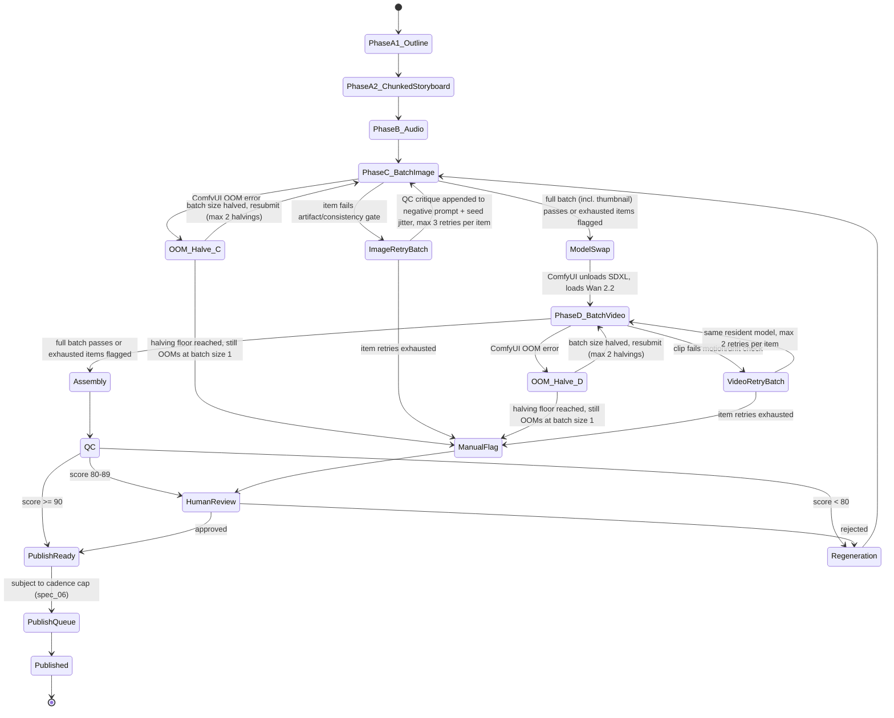

# Spec 03 — Agent Roster, State Machine & QC Scoring Engine
**Source:** decomposed from Master Blueprint v2.2, §3.1 (Phase A detail), §4, §4.1, §6. Owns: deterministic FSM, chunked LLM handoff logic, QC weights/thresholds, structured critique schema, webhook contract.

---

## 1. Agent Roster & Responsibilities

| Agent | Owns | Phase |
|---|---|---|
| Creative Director | Episode structural skeleton (scene count, arc beats, character list) | A1 |
| Storyboard Agent | Scene-by-scene detailed shot/prompt generation | A2 |
| Character Agent | Resolves Character Bible references per scene | A2 |
| Audio/Music Agent | ACE-Step song + Kokoro narration + Demucs stem isolation + onset extraction | B |
| Visual Prompt Agent | ComfyUI batch-image job builder (incl. thumbnail); QC-critique-driven corrective prompting | C |
| Video Gen Agent | ComfyUI batch-video job builder | D |
| Assembly Agent | Beat-Driven Cut Sync (onset-aligned) | post-D |
| QC Agent | 0–100 scoring engine, emits structured failure critiques | post-Assembly |
| Asset Manager | Garbage collection, `hold_from_gc`, offsite backup, webhook alerting | cross-cutting |
| Publishing Agent | Cadence cap, thumbnail attach, localized metadata, `videos.insert` | post-QC |

---

## 2. Chunked Handoff LLM Logic (Phase A1 → A2)

**Problem this solves:** a single LLM call asked to produce 15–20 fully-detailed, mutually-consistent scene prompts at once measurably degrades output quality/specificity as context grows.

**A1 — Master Outline (one call):**
- Input: theme/rhyme seed, target episode length, active Character Bible entries.
- Output: terse structural skeleton — scene count, narrative arc beats, which characters appear, theme/lyric hook. **Not** a shot list.
- Model: Gemini Flash/Flash-Lite `[VFA]` or local Ollama `[OSL]`.

**A2 — Chunked Storyboard (N calls, one per scene or 2–3 scene chunk):**
- Input per call: the A1 outline + **only that scene's** local context (previous scene's ending beat for continuity, nothing further back).
- Output per call: detailed shot description, camera direction, SDXL/FLUX prompt text for that scene.
- The Character Agent resolves Character Bible references (seed, IP-Adapter refs, negative-prompt lock) inline during this same pass.
- **Aggregation rule:** once every scene has been iterated, all detailed per-scene prompts combine into one ordered queue — this becomes Phase C's batch input (spec_01, spec_04).
- **Cost model:** chunking trades a small number of extra LLM calls (~12–16 total vs. 1) for materially higher per-scene prompt fidelity. Zero VRAM cost either way (spec_01 §5).

---

## 3. Deterministic State Machine



**Webhook side-effect (non-blocking):** entry into `HumanReview` — from a QC score of 80–89, OR via `ManualFlag` after exhausted retries, OR after an exhausted OOM-halving floor — fires an async webhook (§5 below) as a side effect. It does **not** gate the `PublishReady`/`Regeneration` transition, which depends solely on the operator's approve/reject action.

---

## 4. Deterministic Retry Rules

### 4.1 Image artifact retry — QC-critique-driven (`ImageRetryBatch`)

Failed Phase C items are **not** regenerated one-by-one immediately — they queue into `ImageRetryBatch` and are re-submitted as a follow-up pass **while SDXL is still resident** (preserves the VRAM-optimization contract in spec_01).

The QC Agent's specific failure reason is passed back to the Visual Prompt Agent, which appends a **targeted corrective negative prompt** in addition to seed jitter (+1000 delta/attempt). Retry specificity escalates:

| Attempt | Action |
|---|---|
| 1 | seed jitter + generic critique term |
| 2 | seed jitter + full critique phrase |
| 3 (final) | seed jitter + critique phrase + increased IP-Adapter weight |

Cap: 3 attempts per item, then `ManualFlag`. Critique payload contract (persisted to `GENERATIONS.last_qc_critique`, spec_02):

```json
{
  "generation_id": 4821,
  "failure_reason": "consistency_fail",
  "detail": "costume_color_drift",
  "corrective_negative_prompt_append": "off-model costume color, wrong boot color",
  "attempt": 2
}
```

Common `failure_reason` values: `low_visual_quality` (detail e.g. `motion_blur_detected`), `consistency_fail` (detail e.g. `costume_color_drift`, `facial_structure_drift`).

### 4.2 Video motion drift retry (`VideoRetryBatch`)

Identical batching pattern applied to Phase D. Motion-strength parameter reduced 20% per attempt. Cap: 2 attempts (video gen is the most compute-expensive step — fail fast to human review).

### 4.3 OOM adaptive halving

See **spec_01 §4** for the full algorithm. State-machine integration: `OOM_Halve_C` / `OOM_Halve_D` states sit upstream of the artifact/consistency retry states — an OOM is an infrastructure failure resolved before quality gating is even attempted on the affected items.

### 4.4 Model-swap boundary discipline

The FSM only transitions `PhaseC_BatchImage → ModelSwap → PhaseD_BatchVideo` once the *entire* image batch (including retries and OOM halving) resolves to `approved` or `manually_flagged`. No video-model load event may overlap an unresolved image batch.

### 4.5 Credit exhaustion / crash resumability

- Cloud LLM 429 during A1/A2 → fall back to local Ollama for that call, log to `CREDIT_TRACKER`. Never block the pipeline on a cloud dependency.
- Every job status persisted to `GENERATIONS` on each poll → a ComfyUI crash mid-batch resumes from the last incomplete item, not a full phase re-run.

---

## 5. Asynchronous Webhook Alerting (`HumanReview` entry)

**Trigger conditions:** QC total score 80–89, retries exhausted on any batch item, or an OOM-halving floor reached.

**Delivery:** single fire-and-forget HTTP POST to a Slack Incoming Webhook or Discord Webhook URL. No polling on either side.

**Payload contract:**
```json
{
  "event": "human_review_required",
  "episode_id": "ep014",
  "trigger_reason": "qc_score_80_89",
  "qc_scores": {
    "visual_quality": 78,
    "consistency": 91,
    "beat_sync": 88,
    "appropriateness": 95,
    "repetition": 90,
    "total": 84
  },
  "review_queue_url": "http://localhost:8188/review/ep014",
  "timestamp": "2026-08-23T14:02:11Z"
}
```

**Reliability:** 3x retry, exponential backoff (1s/2s/4s) on non-2xx. Delivery failure is logged but **never blocks the state machine** — the review queue UI is the source of truth; webhook is convenience only. Webhook URL stored as an env var/secret, never committed.

---

## 6. QC Scoring Engine

| Metric | Weight | Method |
|---|---|---|
| Visual Quality | 20 | OpenCV blur/artifact detection + local aesthetic-score model (CLIP-IQA) |
| Character Consistency | 25 | CLIP-embedding similarity vs. Character Bible reference pool (includes thumbnail) |
| Beat-Sync Accuracy | 20 | % of scene cuts/body-bob keyframes landing within ±80ms of a detected onset (isolated stem — full method: spec_05) |
| Educational Appropriateness | 15 | Local Ollama rubric pass: no violence/scares, age-appropriate vocabulary, positive resolution |
| Repetitive Content Detection | 20 | Perceptual-hash + lyric n-gram comparison vs. last N published episodes |

**Structured critique emission:** any metric scoring below its own pass threshold emits a machine-readable failure reason alongside the numeric score (schema: §4.1 above) — this is what feeds the corrective-prompting retry loop rather than relying on seed variation alone.

**Decision thresholds:**
| Total score | Decision | Routing |
|---|---|---|
| ≥ 90 | `publish_ready` | → Publishing Agent (cadence-capped, spec_06) |
| 80–89 | `human_review` | → review queue UI + webhook (§5) |
| < 80 | `regenerate` | → Phase C, critique attached, not a full episode restart |

## 7. Cross-References
- ComfyUI job submission mechanics referenced by Visual/Video Gen Agents: **spec_04**.
- Onset-grid extraction underlying Beat-Sync Accuracy: **spec_05**.
- Publishing Agent's cadence cap and localized metadata step following `PublishReady`: **spec_06**.
